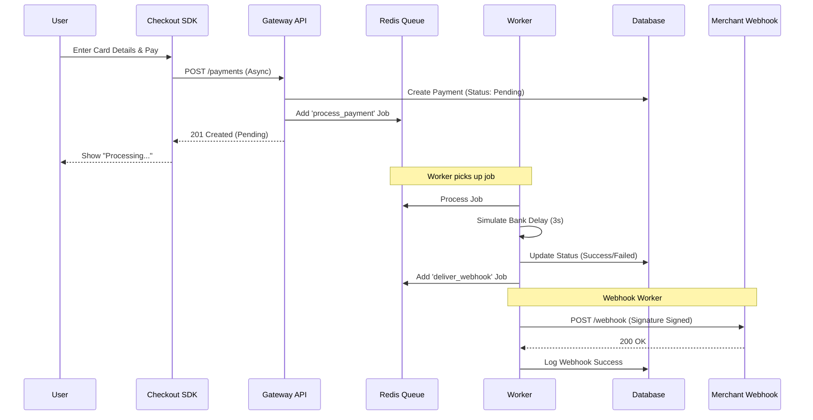
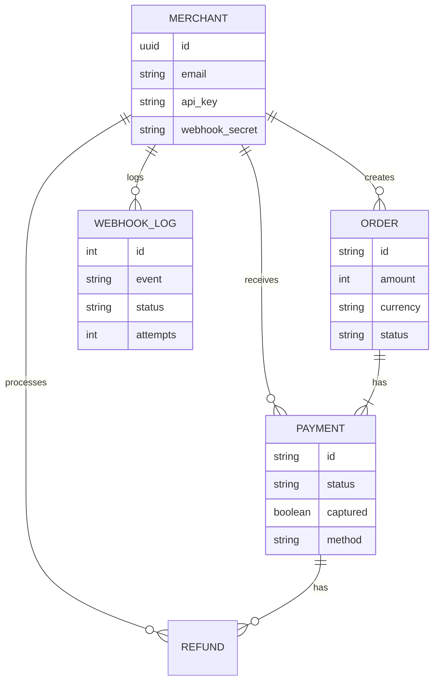

# System Architecture

## Component Overview

```mermaid
graph TD
    Client[Client Browser]
    Merchant[Merchant Server]
    
    subgraph "Payment Gateway System"
        API[API Service (Node.js)]
        Worker[Worker Service (Node.js)]
        Redis[(Redis Queue)]
        DB[(PostgreSQL)]
        Dashboard[Dashboard (React)]
        Checkout[Checkout SDK (React)]
    end

    Client -- "1. Initiates Pay" --> Merchant
    Merchant -- "2. Creates Order" --> API
    API -- "3. Returns OrderID" --> Merchant
    Merchant -- "4. Passes OrderID" --> Client
    Client -- "5. Loads SDK" --> Checkout
    Checkout -- "6. Submits Payment" --> API
    
    API -- "7. Enqueue Job" --> Redis
    API -- "8. Return Pending" --> Checkout
    
    Redis -- "9. Process Job" --> Worker
    Worker -- "10. Update Status" --> DB
    Worker -- "11. Send Webhook" --> Merchant
    
    Dashboard -- "Manage/View" --> API
    API -- "Read/Write" --> DB
```

## Async Payment Flow



## Database Schema


