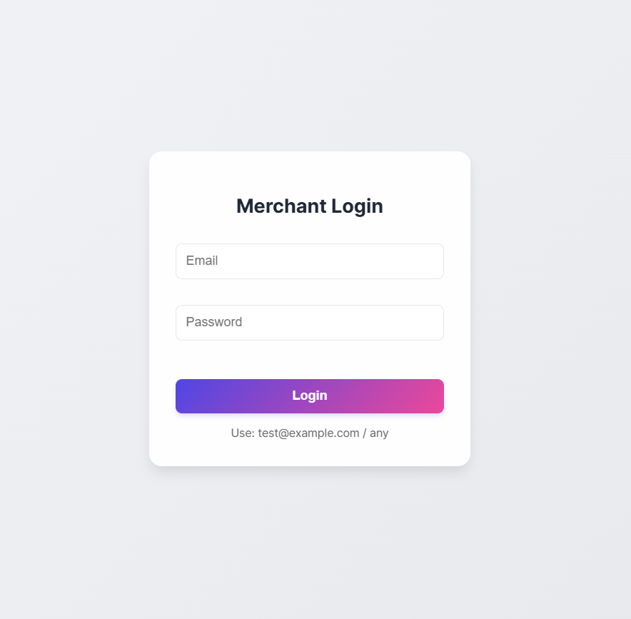
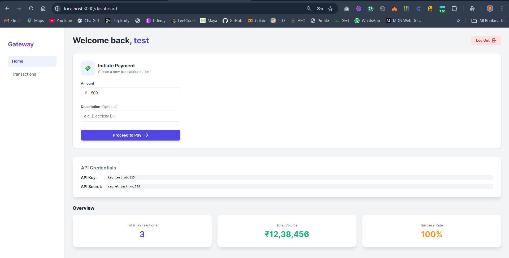

# Payment Gateway

A foundational payment gateway implementation similar to Stripe/Razorpay, featuring Merchant Onboarding (simulated), Order Management, and a Hosted Checkout Page supporting UPI and Card payments.

## Features

- **Merchant Dashboard**: View API keys and transaction history.
- **RESTful API**: Secure endpoints for Order creation and Payment processing.
- **Hosted Checkout**: Professional UI for customers to complete payments.
- **Payment Simulation**: Simulates bank processing delays and random success/failure rates.
- **Production Ready**: Fully Dockerized with Nginx serving frontend applications.

## Documentation

- [API Documentation](API.md) - Full list of endpoints and usage.
- [System Architecture & Schema](SCHEMA.md) - Database design and system components.

## Tech Stack

- **Backend**: Node.js, Express, Sequelize
- **Database**: PostgreSQL
- **Frontend**: React, Vite
- **Deployment**: Docker, Docker Compose, Nginx

## Setup & Running

1.  **Clone the repository**.
2.  **Navigate to the project root**:
    ```bash
    cd payment-gateway
    ```
3.  **Run with Docker Compose**:
    ```bash
    docker-compose up -d --build
    ```
4.  **Access the applications**:
    - **API**: [http://localhost:8000](http://localhost:8000)
    - **Dashboard**: [http://localhost:3000](http://localhost:3000)
    - **Checkout**: [http://localhost:3001](http://localhost:3001)

## Quick Start (Testing)

1.  **Login to Dashboard**:
    - URL: [http://localhost:3000/login](http://localhost:3000/login)
    - Email: `test@example.com`
    - Password: `any`
    - **Note**: Copy your API Key and Secret from the dashboard.

2.  **Create an Order** (Use Postman or Curl):
    ```bash
    curl -X POST http://localhost:8000/api/v1/orders \
      -H "Content-Type: application/json" \
      -H "X-Api-Key: key_test_abc123" \
      -H "X-Api-Secret: secret_test_xyz789" \
      -d '{"amount": 50000, "currency": "INR", "receipt": "test_1"}'
    ```

3.  **Complete Payment**:
    - Copy the `id` from the response (e.g., `order_...`).
    - Open `http://localhost:3001/checkout?order_id=<ORDER_ID>`.
    - Pay using UPI or Card.

## Test Data

Use these valid test card numbers (Luhn-compliant) for testing:

| Network | Number | Expiry | CVV |
|:---|:---|:---|:---|
| **Visa** | `4242 4242 4242 4242` | Future Date | Any |
| **Mastercard** | `5555 5555 5555 4444` | Future Date | Any |
| **Amex** | `3782 822463 10005` | Future Date | Any |
| **RuPay** | `6080 0000 0000 0002` | Future Date | Any |

> **Note**: For UPI testing, use any VPA format like `user@paytm`.


## Visual Walkthrough

### Dashboard
| Login | Dashboard Home |
|-------|----------------|
|  |  |

| Initiate Payment | Transactions |
|------------------|--------------|
|  |  |

### Checkout Flow
| Checkout Page | UPI Payment | Card Payment |
|---------------|-------------|--------------|
|  |  |  |

| Processing | Success | Failure |
|------------|---------|---------|
|  |  |  |
