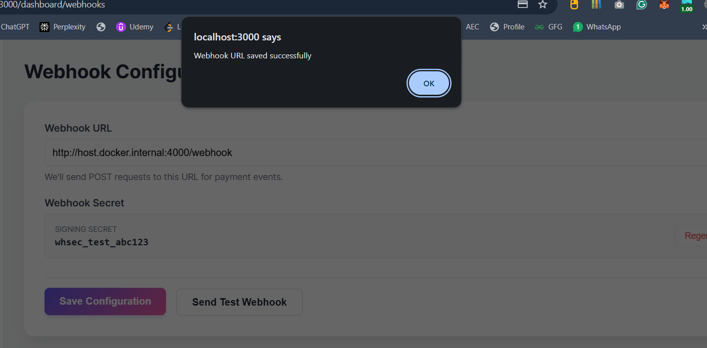
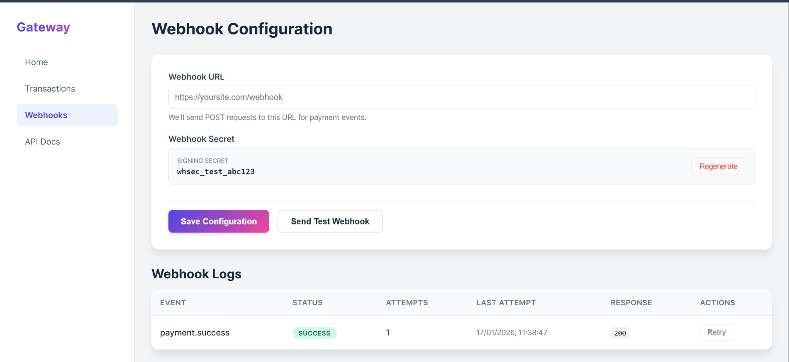
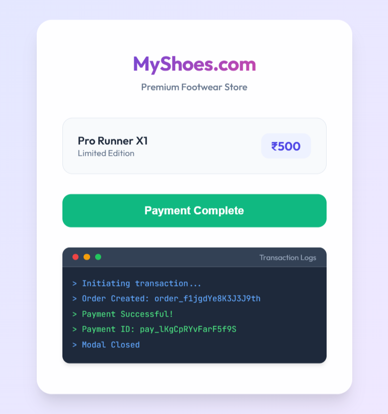

# Payment Gateway

A production-ready payment gateway implementation supporting **asynchronous processing**, **webhook delivery**, and a **hosted checkout SDK**. Built with Node.js, React, and PostgreSQL.

## Features

- **Asynchronous Architecture**: Payment processing and webhook delivery offloaded to background workers using Redis queues.
- **Webhook System**: Secure event delivery with HMAC-SHA256 signatures and exponential backoff retries.
- **Hosted Checkout SDK**: Embeddable JavaScript SDK/Iframe for secure payment collection.
- **Merchant Dashboard**: Comprehensive UI for monitoring transactions, managing webhooks, and ensuring system health.
- **Idempotency**: Robust handling of duplicate requests using `Idempotency-Key` headers.
- **Refunds**: Full and partial refund support via API.

## Repository Structure

- `backend/`: Node.js Express API + Worker Services
- `frontend/`: React Dashboard Application
- `checkout-page/`: Hosted Checkout Page + JS SDK
- `test-merchant/`: Demo Merchant Application for integration testing

## Setup & Running

**Prerequisites**: Docker & Docker Compose

1.  **Start Services**:
    ```bash
    docker-compose up -d --build
    ```
    *This starts the API, Worker, Dashboard, Checkout Service, Redis, and PostgreSQL.*

2.  **Access Applications**:
    - **Dashboard**: [http://localhost:3000](http://localhost:3000) (Login: `test@example.com` / `password`)
    - **API**: [http://localhost:8000](http://localhost:8000)
    - **Checkout SDK**: [http://localhost:3001/checkout.js](http://localhost:3001/checkout.js)
    - **Test Merchant**: [http://localhost:4000](http://localhost:4000)

## API Documentation

### Authentication
All API requests require the following headers:
- `X-Api-Key`: Your generic public key
- `X-Api-Secret`: Your secret key (keep this safe!)

### Core Endpoints

#### Create Order
`POST /api/v1/orders`
```json
{
  "amount": 50000,
  "currency": "INR",
  "receipt": "receipt_123"
}
```

#### Initiate Refund
`POST /api/v1/payments/:id/refunds`
```json
{
  "amount": 1000,
  "reason": "Customer request"
}
```

## SDK Integration Guide

The Payment Gateway provides a drop-in JavaScript SDK.

1.  **Include the Script**:
    ```html
    <script src="http://localhost:3001/checkout.js"></script>
    ```

2.  **Initialize & Open**:
    ```javascript
    const checkout = new PaymentGateway({
      key: 'YOUR_API_KEY',
      orderId: 'ORDER_ID_FROM_BACKEND',
      onSuccess: (data) => {
        console.log('Payment ID:', data.id);
      },
      onFailure: (error) => {
        console.error('Failed:', error);
      }
    });

    checkout.open();
    ```

## Webhook Integration Guide

We send HTTP POST webhooks for events like `payment.success` and `refund.processed`.

### Verification (Security)
Verify the `X-Webhook-Signature` header using your **Webhook Secret**.

```javascript
const crypto = require('crypto');
const signature = req.headers['x-webhook-signature'];
const expected = crypto
  .createHmac('sha256', WEBHOOK_SECRET)
  .update(JSON.stringify(req.body))
  .digest('hex');

if (signature === expected) {
  // Verified!
}
```

## Testing Instructions

We have provided a `test-merchant` app to verify the end-to-end flow.

1.  Go to [http://localhost:4000](http://localhost:4000).
2.  Open the **Dashboard** at [http://localhost:3000](http://localhost:3000) and configure the details.
    -   **Important**: Copy the API Key/Secret from Dashboard to `test-merchant/public/index.html` (lines 87-88) if you want to use your specific merchant account, though defaults are provided.
    -   **Webhook URL**: Set to `http://host.docker.internal:4000/webhook` (or `http://172.17.0.1:4000/webhook` on Linux).
3.  Click **Pay Now** on the Test Merchant page.
4.  Complete the payment.
5.  Check the **Dashboard Webhooks** page to see the delivery log.

## Environment Variables

Services are configured via `docker-compose.yml`. Key variables include:

-   `DATABASE_URL`: PostgreSQL connection string.
-   `REDIS_URL`: Redis connection string.
-   `JWT_SECRET`: Secret for dashboard authentication.
-   `ENCRYPTION_KEY`: Key for encrypting sensitive data.
-   `webhook_retry_intervals`: JSON array for backoff strategy.

## Visual Walkthrough

### Dashboard
| Login | Dashboard Home |
|-------|----------------|
|  |  |

| Initiate Payment | Transactions |
|------------------|--------------|
|  |  |

### Checkout Flow
| Checkout Page | UPI Payment | Card Payment |
|---------------|-------------|--------------|
|  |  |  |

| Processings | Success | Failure |
|------------|---------|---------|
|  |  |  |

### Webhook Configuration
| Webhook Setup | Webhook Logs |
|---------------|--------------|
|  |  |

### Test Merchant
| Merchant View | Payment Completion |
|---------------|-------------------|
|  |  |w3

## Video Demo

- [Watch Demo Video 1](https://drive.google.com/file/d/1WCKzANOFWjKvwV0o2zmbUx4WLCf5NdKQ/view?usp=sharing)
- [Watch Demo Video 2](https://drive.google.com/file/d/1KGt3R6znpJncrFKLPvxIz6ui5RGwKgoJ/view?usp=sharing)
