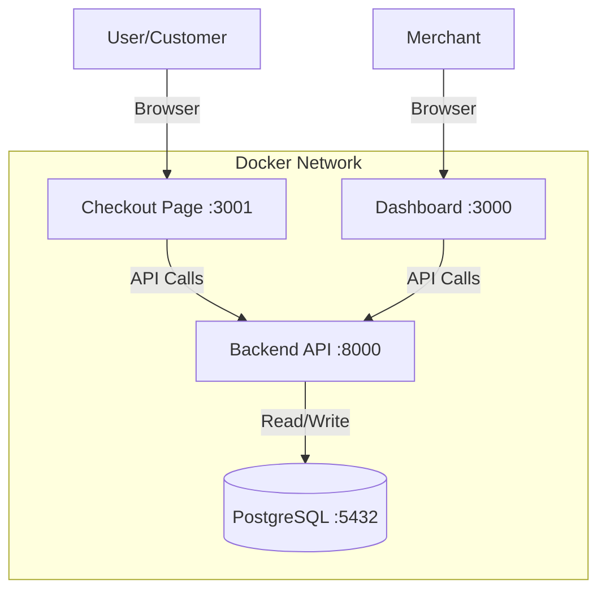

# System Architecture & Database Schema

## System Architecture

## Database Schema
### Merchants Table
Stores merchant credentials and details.
| Column | Type | Description |
|--------|------|-------------|
| `id` | UUID | Primary Key |
| `name` | String | Merchant Name |
| `email` | String | Unique Email |
| `api_key` | String | API Key (Unique) |
| `api_secret` | String | API Secret |
| `is_active` | Boolean | Status |

### Orders Table
Represents a payment request created by a merchant.
| Column | Type | Description |
|--------|------|-------------|
| `id` | String | PK (`order_` + 16 chars) |
| `merchant_id` | UUID | FK to Merchants |
| `amount` | Integer | Amount in paise |
| `currency` | String | Default 'INR' |
| `status` | String | 'created', 'paid' |

### Payments Table
Stores individual transactions.
| Column | Type | Description |
|--------|------|-------------|
| `id` | String | PK (`pay_` + 16 chars) |
| `order_id` | String | FK to Orders |
| `merchant_id` | UUID | FK to Merchants |
| `amount` | Integer | Amount |
| `method` | String | 'upi' or 'card' |
| `status` | String | 'processing', 'success', 'failed' |
| `vpa` | String | (UPI only) |
| `card_network`| String | (Card only) |
| `updated_at` | Timestamp | Last status change |
